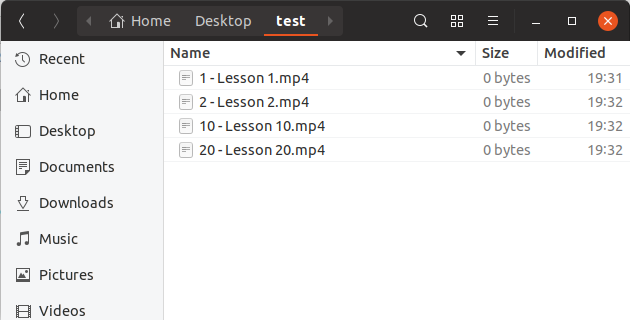

# Overview
This project wrap many useful utilities.

# 1. Comparators
Grouped in `com.betanzos.comparators`.

## 1.1. AlphanumericStringComparator
Compare the `String` representation of two `Object`s. If this `String` representations result in an alphanumeric 
`String` this class allows to treat the sequential numeric parts present in the strings as numbers, which will 
compares as such. With this in mind, fallowing strings will be equals:<br>
- "My serial 2x01.mp4",<br>
- "My serial 2x1.mp4" and<br>
- "My serial 2x00000001.mp4"

This behaivor is very useful to sort by name files and folders within a directory.

**Example:** Sort directory content.



List dir contect as loaded:
```
var dir = new File("/home/user/Desktop/test");

var dirContent = dir.listFiles();
Arrays.asList(dirContent)
        .stream()
        .map(File::getName)
        .forEach(System.out::println);
```
output:
```
10 - Lesson 10.mp4
2 - Lesson 2.mp4
20 - Lesson 20.mp4
1 - Lesson 1.mp4
```
Sorting by file/folder name (because all of there share the parent path):
```
Arrays.sort(dirContent, new AlphanumericStringComparator());
Arrays.asList(dirContent)
        .stream()
        .map(File::getName)
        .forEach(System.out::println);
```
output:
```
1 - Lesson 1.mp4
2 - Lesson 2.mp4
10 - Lesson 10.mp4
20 - Lesson 20.mp4
```
